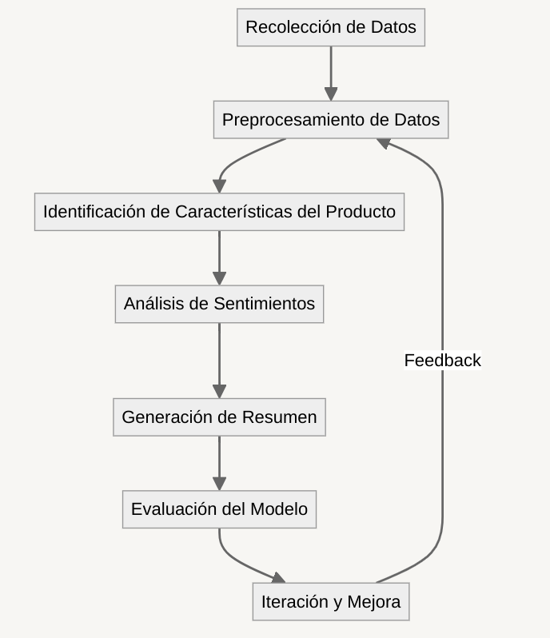
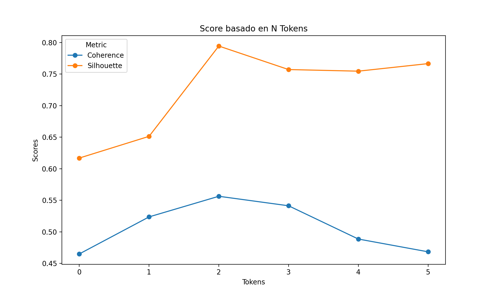

# Resumidor de Opiniones Automático

Integrantes:

- Juan Bratti
- Ignacio Scavuzzo

Repositorio: https://github.com/juanbratti/tm24_pln_proyecto

# Introducción

Este proyecto se desarrolló en el marco de la materia Minería de Texto, en la que abordamos técnicas de **aprendizaje no supervisado** aplicadas al procesamiento de texto. 

Como proyecto propusimos implementar un sistema modular que lo que realiza es: dado un producto en la web y sus reseñas, genere un resumen en forma de texto de las características mencionadas mas relevantes y ayude a los usuarios a tener información sobre el producto sin necesidad de leer las reseñas.

La planificación se llevó a cabo definiendo etapas específicas, incluyendo la evaluación de enfoques, la toma de decisiones de diseño y la validación de resultados. Si bien la idea del proyecto es también que la implementación funcione, uno de nuestros principales objetivos fue explorar técnicas para el modelado de tópicos, análisis de sentimiento y otros conceptos del área. 

# Objetivos Preliminares

1. Procesar los datasets y obtener un archivo con productos y sus reseñas.
2. Realizar la etapa de preprocesamiento para limpiar, tokenizar los datos.
3. Identificar tópicos de una review usando LDA.
4. Hacer *sentiment analysis* de una review y para cada tópico presente identificar su positividad/negatividad
5. Generar un resumen usando un LLM.
6. Evaluar el modelo usando métricas.
7. Iterar y mejorar

# Hipótesis Iniciales

**Hipótesis General:**

Como hipótesis general planteamos que la utilización de un modelo de procesamiento de lenguaje natural podrá con precision generar un resumen que agrupe las características valoradas por otros consumidores. 

**Hipótesis Específicas:**

Por otro lado, planteamos algunas sub-hipótesis mas especificas que queremos desarrollar:

1. Una mayor cantidad de reseñas sobre un producto implicará un mejor resumen.
2. Existe un número optimo de cantidad de palabras que se toman a la hora de tokenizar y ofrece mejores resultados que otras cantidades.
3. Información sobre el producto (su titulo y especificaciones) ayuda significativamente al modelo a realizar categorización y análisis. 
4. Las stopwords influyen negativamente en el desempeño del modelo.

De estas hipótesis, se deducen experimentos básicos pero que aportan información suficiente para realizar conclusiones.

1. Probar el modelo para distintas cantidad de reseñas. Tomar ciertos intervalos y ver la relación entre cantidad de reseñas y la precision del resumen.
2. Nuevamente, probar para distintas cantidades de palabras por token.

# Estructura del Proyecto

La estructura general del proyecto sigue un pipeline diseñado para abordar de manera flexible la tarea de análisis y procesamiento de datos de reseñas. Dividimos el pipeline en las siguientes etapas:

- **Recolección de Datos**: Nos enfocamos en buscar y recolectar datos que sean relevantes para nuestro proyecto, de tal manera que sean representativos, amplios y tengan sentido.
- **Preprocesamiento de Datos**: Etapa encargada de transformar los datos crudos obtenidos en la etapa anterior, en un conjunto de datos limpio y preparado para su uso en los modelos presentes en etapas posteriores.
- **Identificación de Características del Producto**: Usando el conjunto de datos limpio, en esta etapa se busca poder identificar los temas y aspectos emergentes en las reseñas, comparando los resultados con distintos modelos.
- **Análisis de Sentimientos**: Aquí aplicamos un modelo de análisis de sentimiento para evaluar la polaridad (positiva, negativa o neutral) de las opiniones expresadas en las reseñas, pudiendo así obtener información que nos será útil a la hora de realizar prompting para la generación del resumen.
- **Generación de Resumen**: Empleamos modelos de lenguaje abiertos para generar breves resúmenes representativos de las opiniones de los usuarios, utilizando los tópicos detectados y los sentimientos.
- **Evaluación**: La idea de esta etapa es validar el pipeline y concluir el trabajo realizado.
- **Iteración y mejora**: Finalmente, contamos nuestra experiencia desarrollando el proyecto y planteamos posibles avances y mejoras para el futuro.

Ahondaremos en cada una de estas etapas debajo.



Figura 0: Diagrama del pipeline.

## 1. **Recolección de Datos**

Para el proyecto fue importante buscar y recolectar datos que sean relevantes para lo que queríamos lograr. Nos centramos en asegurarnos que aquellos datos que encontráramos tuvieran las siguientes características:

- **Comprenda un gran volumen de reseñas**: Esto es importante ya que con un gran conjunto de reseñas podemos realizar un análisis más representativo de las mismas, pudiendo así detectar mayor cantidad de tópicos y generar resúmenes que logren de mejor manera representar la cantidad y contenido de las reseñas.
- **Sean datos provenientes de usuarios**: Dado que nuestro objetivo principal fue analizar opiniones reales, nos aseguramos de utilizar datos generados directamente por los usuarios. Esto si bien implica un desafío ya que los textos generados por usuarios generalmente contienen errores gramaticales, un uso informal del lenguaje o información difícil de analizar debido a la falta de estructura, también permite que el proyecto tenga un contexto auténtico para poder así tener resultados más representativos y aplicables a casos reales.
- **Sean de fácil acceso**: La mayoría de datos provenientes de plataformas ecommerce no suelen ser de fácil acceso, por lo que fue un desafío poder encontrar reseñas que provengan de fuentes reales.

Para el proyecto utilizamos datos provenientes de reseñas de Amazon, los mismos son: https://cseweb.ucsd.edu/~jmcauley/datasets/amazon/links.html (https://snap.stanford.edu/data/web-Amazon-links.html). Inicialmente usamos las reseñas de una máquina de costura (Serger).

Para poder usar correctamente los datos, tuvimos que transformar (implementando un parser) el formato original en .txt en formato .csv para poder facilitar el trabajo con `Pandas` y así estandarizar el manejo de los datos. El parser se encuentra dentro de la carpeta `data`. 

## 2. **Preprocesamiento de Datos**

El pipeline de trabajo en la etapa de procesamiento se construyó de forma modular de tal manera que sea fácil poder probar distintas configuraciones para la limpieza y tokenización. 

Las partes importantes de esta etapa son:

1. Procesamiento de las reseñas: Para el procesamiento de las reseñas implementamos una función `load_and_preprocess_data` que se encarga de tomar el archivo `.csv` parseado y las procesa en un Series de Pandas. En esta misma funcionalidad, se realiza la limpieza de las reseñas la función mencionada aquí abajo.
2. Limpieza de las reseñas: Implementamos una función `clean_reviews` (que se ejecuta dentro de `load_and_preprocess_data`) encargada de eliminar elementos no deseados como emojis, contracciones, caracteres especiales, espacios en blanco extra, entre otras decisiones. Para especificar qué eliminar y qué no, usamos un archivo aparte `config` que contiene dentro un diccionario con una especie de “hiperparametros”. Esto nos permite analizar el funcionamiento general de los módulos de una manera simplificada, pudiendo probar distintas configuraciones sin necesidad de cambiar sustancialmente el código.
    - La función `clean_reviews` devuelve un Series de Pandas con las reseñas limpias.
    
    Contenido de `config` :
    
    ```python
    # configuración usada a lo largo del proyecto
    
    params = {
        'new_reviews': 0,  # 0 for old reviews, 1 new reviews
        'product_review_count': 596,
        'tokens': 0,
        # delete?
        'nan': True, 
        'emojis': True,
        'contractions': True,
        'special_chars': True,
        'whitespaces': True,
        'stopwords': True,
        'lemmatization': True,
        'lowercase': True,
        'emails_and_urls': True,
        'nouns': False,
        'adj': False,
        'numbers': True,
        'most_frequent': 0
    }
    ```
    
    Notar que en el diccionario tenemos el parámetro `new_reviews` , este parámetro puede valer 0 o 1, dependiendo del dataset que se utilice. 
    
    - `new_reviews=0` : se usa el dataset mencionado arriba.
    - `new_reviews=1` : se usa un dataset alternativo (usado de forma experimental, no es el que se usa para desarrollar el proyecto)
3. Tokenización de las reseñas: para la tokenización de las reseñas, implementamos también otra función, `tokenize_reviews`, que permite tanto la división en oraciones como la tokenización en secuencias de $n$-gramas, dependiendo de lo que se especifique en los parámetros de la función. 
    
    Esta función devuelve una lista de Python con las divisiones correspondientes. Llamaremos a las divisiones “secuencias”
    
    Algo a destacar es que la lematización y la eliminación de stopwords se realiza en esta función (no en `clean_reviews`), y se hace posterior a la división en secuencias.
    
    - `tokens=0` : división por oraciones

## 3. **Identificación de Características del Producto**

Para un producto, realizaremos la tokenización en secuencias de $n$-palabras de sus reviews. Luego, lo que haremos será encontrar en las secuencias, las características sobre el producto de las que se opina. Para esto aplicamos:

- **Modelado de Tópicos**: Entrenaremos un modelo para agrupar los conjuntos de $n$-palabras según características identificadas en las mismas.
    
    Guardaremos esta información en un DataFrame con la siguiente estructura:
    
    | Sequence | Topic Assigned |
    | --- | --- |
    | 0 | Topic 1 |
    | 1 | Topic 2 |
    | … | … |

Cuando hablamos de un tópico, nos referimos a una lista de palabras que representan el “cluster”.

En un momento inicial del proyecto, no estimamos correctamente el esfuerzo que llevaría esta etapa. Dada la naturaleza del mismo. El módulo de modelado de tópicos, terminaría siendo fundamental, y uno que mejorar y ajustar. Inicialmente, planteamos la utilización de LDA (*Latent Dirichlet Allocation*). Sin embargo, al analizar los tópicos de manera cualitativamente, nos dimos cuenta que debíamos, al menos, probar alternativas. Los tópicos no eran lo suficiente disjuntos como esperábamos, se veían tópicos que contenían palabras como *love* o *bad* y mostraban mucho ruido, que nosotros interpretamos como ambigüedades no deseadas.

Ya que es un producto que debe servir a un usuario, dimos mucha importancia al análisis cualitativo y nuestra interpretación de los resultados. Por esto, decidimos probar otros modelos de modelado de tópicos como *Kmeans* y *BERTopic*. A simple vista, BERTopic parecía el más adecuado para nuestros objetivos.


Figura 1: Tópicos encontrados por BERTopic


Figura 2: Tópicos encontrados por LDA

Lo que podemos observar de la Figura 1 y 2, es que BERTopic presenta tópicos con palabras más “relacionadas” entre ellas, y que además cada tópico tiene una palabra con un peso mucho mas significativo que el resto, lo que nos permite darle una *label* a cada tópico, o simplemente identificar a que se puede referir. Esto no ocurre con LDA.

Para apoyar nuestro análisis cualitativo, decidimos usar algunas métricas para comparar LDA y BERTopic. Estas son:

- Coherence score (en particular c_v): Mide que tan coherentes son las palabras dentro de un tópico. Valores mas altos indican que las palabras están mas relacionadas entre sí. Esto lo calcula basándose en su similitud semántica y co-ocurrencia en los textos.
- Silhouette score: Evalúa la calidad de las agrupaciones, basándose en la distancia entre los puntos de un cluster y los vecinos.

Nos interesa ver como varían estas métricas según el modelo y además ver el impacto de la cantidad de reviews en el modelado.


Figura 3: Coherence Score para BERTopic y LDA en función de la cantidad de Reviews.


Figura 4: Silhouette Score para BERTopic y LDA en función de la cantidad de Reviews.

Decidimos reducir la cantidad de tópicos a 10, usando funciones que los mergeen según jerarquía y similitud entre ellos. Esto para que productos de mayor cantidad de reseñas no tengan una cantidad muy alta de tópicos y por lo tanto complicaciones a la hora de generar el resumen.

Esta decisión pudo llegar a influir en la “baja” de las métricas para mas reviews. Según fuentes, un Coherence Score de 0.4 es aceptable. Está observación sumada a los resultados del Silhouette Score y cuestiones como, la documentación, funciones de la librería e información que lo sostienen, nos hace elegir BERTopic. Por supuesto, la superioridad que notamos en este ultimo, se debe a su estructura mas compleja.

### Replanteo de Objetivos

Una vez definido el modelo, se nos presenta un dilema. Nuestro objetivo inicial era que el modelado de tópicos agrupara de tal manera que nos fuera facil categorizar en características definidas como precio, calidad, uso, etc.  Luego de feedback de la profesora y de compañeros, decidimos entre dos alternativas:

- Procesar aun mas el dataset y reducirlo para poder encontrar temas definidos previamente como Precio, Calidad, Uso, etc.
- Utilizar los tópicos encontrados por los modelos actuales, que no son los definidos previamente pero que refieren a características del producto.

El primero es un tanto mas complejo: Debe usarse una seed list en un intento de modelo semi-supervisado, pero que aun así, no nos ha dado los resultados deseados. Además, requiere de análisis lingüísticos mas profundos.

El segundo nos ha dado un poco mas de resultado, y sus tópicos permiten describir al producto y ayudaran a generar un resumen literal de lo mencionado en las reseñas. Quizá pueda pensarse como que refiere mas a lo explicito, mientras que el primero refiere a lo implícito.

Por lo tanto, decidimos continuar el proyecto siguiendo el segundo enfoque.

## 4. **Análisis de Sentimientos**

Además de la detección de los tópicos, a cada secuencia (oraciones) le asignamos el sentimiento aproximado. Este sentimiento tiene una representación numérica, en donde 0 es neutro, <0 es negativo y >0 es positivo.

Para realizar esto, usamos la librería `TextBlob`, que es una librería fácil de usar y que es bastante precisa para textos cortos (nuestro caso ya que nuestras secuencias no suelen ser tan largas). Implementamos entonces una función `sentiment_analysis` en la que gracias a las funciones de `TextBlob`, a cada secuencia le asignamos un tópico (de los tópicos identificados) y un sentimiento, formando así el siguiente DataFrame:

| Sequence | Topic Assigned | Sentiment Assigned |
| --- | --- | --- |
| oración tokenizada 1 | tópico asignado a oración tokenizada 1 | score de sentimiento |
| oración tokenizada 2 | tópico asignado a oración tokenizada 2 | score de sentimiento |
| … | … | … |

## 5. **Generación de Resumen**

Para la generación del resumen, usamos un modelo de lenguaje, específicamente `Llama-3.2-1B-Instruct` que esta especializado en tareas de resumen.

Nos centramos en crear un prompt adecuado para poder guiar al modelo de la forma más adecuada posible. Para ello, construimos el prompt de la siguiente manera:

- Prompt del sistema:
    
    ```python
    """
    You are a review summarizer, specialized in summerizing reviews 
    about a serger sewing machine. You are going to help the user decide 
    whether to buy a serger sewing machine or not. In order to do this, 
    you will use topics identified in the reviews and the sentiment analysis 
    of each topic, plus, the most negative and positive comment. 
    The sentiment analysis score goes from -1 to 1 (worst to best)
    """
    ```
    
- Prompt del usuario
    
    Para construir el prompt del usuario, sacamos para cada tópico:
    
    - Score de sentimiento promedio
    - Secuencia con el score más negativo (más cerca de -1)
    - Secuencia con el score más positivo (más cerca de +1)
    
    Quedando entonces el prompt del usuario de la siguiente manera:
    
    ```python
    """
    The following are topics detected in reviews by users. Give me a short 
    summary of what the reviews say about the product using the following 
    information. Don't use numerical data, just give me a summary of a few lines.:
    \n\n
    """
    +
    (
     f"* Topic 1. Representative words = {represen_wods}\n"
     f"  - Average sentiment score: {avg_sentiment_score}\n"
     f"  - Most negative sentence: {negative_sequence}\n"
     f"  - Most positive sentence: {positive_sequence}\n\n"
    )
    +
    (
     f"* Topic 2. Representative words = {represen_wods}\n"
     f"  - Average sentiment score: {avg_sentiment_score}\n"
     f"  - Most negative sentence: {negative_sequence}\n"
     f"  - Most positive sentence: {positive_sequence}\n\n"
    )
    + ... +
    (
     f"* Topic n. Representative words = {represen_wods}\n"
     f"  - Average sentiment score: {avg_sentiment_score}\n"
     f"  - Most negative sentence: {negative_sequence}\n"
     f"  - Most positive sentence: {positive_sequence}\n\n"
    )
    ```
    

Luego, usando el modelo de Llama, nos comunicamos con la API y obtenemos el mensaje de respuesta.

Para el caso de la máquina de Serger, y usando el prompt para el sistema y usuario mencionados arriba, obtuvimos el siguiente resumen:

```python
"""
The serger sewing machine reviews provided reveal that users are generally 
impressed with the product's quality, performance, and ease of use. They 
praise the machine's ability to handle various fabrics, including heavy-duty 
materials and thick yarns. Many users also appreciate the machine's durability, 
sturdiness, and ability to hold stitches securely. On the other hand, some users 
have expressed concerns about the machine's price, particularly regarding the 
cost of serger thread and the warranty offered by the manufacturer. Overall, 
users seem to be satisfied with the serger sewing machine, and many have 
recommended it to others.
"""
```

## 6. **Evaluación del Modelo**

Decidimos evaluar por etapas e idealmente el modelo final. Nos fue dificil encontrar metricas adecuadas y que representaran las cuestiones cualitativas que queriamos evaluar. Ademas de las evaluaciones que hicimos en la sección de Identificacion de caracteristicas del producto, que debian por un lado solucionar el dilema de LDA vs BERTopic, buscamos responder nuestras hipotesis iniciales:

1. Una mayor cantidad de reseñas sobre un producto implicará un mejor resumen.

Al menos para BERTopic, vemos en las Figuras que un mayor Review Count, implica un mayor SIlhouette Score y un menor Coherence Score. Mientras que el primero apoya nuestra hipotesis, vemos que el segundo no. En nuestro analisis cualitativo, vimos que LDA si mostraba topicos no muy diferenciables ni representativos para pocas reviews. BERTopic, sin embargo, muestra buenos resultados, cualitativamente, para pocas reseñas, una característica que deseamos dada la naturaleza del proyecto.

1. Existe un número optimo de cantidad de palabras que se toman a la hora de tokenizar y ofrece mejores resultados que otras cantidades.
    
    
    
    Figura 5: Coherence y Silhouette Score según número de tokens con tokens entre 0 y 5
    

Notese que $0$ tokens significaba que se tokenizaba por oraciones. Si bien, se simuló para un unico producto y no se tomó una media por una cuestión de recursos y tiempo, podemos ver algo interesante: Ambas metricas concuerdan en un numero optimo de tokens, al menos para este producto.

1. Información sobre el producto (su titulo y especificaciones) ayuda significativamente al modelo a realizar categorización y análisis. 

No encontramos manera de integrarlo en la identificación de características. Sin embargo, esta información sabemos que es util para la construcción del prompt que daremos al generador de resumen.

1. Las stopwords influyen negativamente en el desempeño del modelo.

Ademas decidimos variar algunos otros parametros como la eliminacion o no de: adjetivos, sustantivos, numeros, palabras más frecuentes, etc.


Figura 6: Coherence y Silhouette Score para distintas configuraciones. Las categorías indican lo que se elimina del dataset. Es decir, sin eliminar nada (raw), se obtiene un coherence score entre 0.4 y 0.5. Eliminando las stopwords, se obtiene un coherence score de 0.5, etc.

Aquí, ya que aún podiamos medir el impacto, decidimos borrar las stopwords para todas las categorias siguientes. Vemos claramente que el mayor impacto viene al borrar las stopwords y que incluso borrar cosas como los sustantivos traen un impacto negativo con respecto al que no borra nada. Esto debido al rol que estas palabras cumplen en la generacion de los topicos.

## 7. **Iteración y Mejora**

En el caso de disponer con más tiempo y recursos, proponemos ahondar en los siguientes puntos:

- Refinamiento del preprocesamiento de datos, sería ideal probar con diferentes formas de vectorización o un número distinto de palabras en los tokens. Comparar para cada caso y evaluar los resultados
- Probar diferentes formas de hacer análisis de sentimiento, usando modelos que no se basen en reglas (como Textblob).
- Probar otras formas de modelar los tópicos.
- En la evaluación del modelo, se podría dedicar más tiempo para la evaluación humana de los resultados, a través de la escritura de resúmenes como ground truths las cuales podríamos usar para compararlas a los generados por el modelo.

# Retroalimentación de Nuestros Compañeros

Las siguientes son cuestiones que nuestros compañeros han observado luego de analizar nuestro proyecto:

- ¿Qué modelo se usará para la generación del resumen?
    
    Usamos `Llama-3.2-1B-Instruct` , modelo de Meta especializado en tareas de resumen.
    
- ¿Cómo será la evaluación humana?
    
    Para evaluar los resúmenes creados, la idea al inicio fue leer las reseñas en nuestro dataset de forma manual con el fin generar resúmenes de ejemplo (ground truths), para luego compararlos con el resumen generado, evaluando así la precisión y representación del resumen devuelto por el LLM. Debido a falta de tiempo, no pudimos llevarlo a cabo, por lo que lo dejamos en caso de avanzar con el proyecto en otro momento.
    
- Por último, había dos preguntas relacionadas:
    - ¿Qué sucede si las reseñas vienen con un puntaje permitido por la página? (Ej: 5 estrellas, 9/10, entre otros.) ¿Eso se tiene en consideración también?
        
        En el caso de tener un dataset que contenga el puntaje dado por el usuario, se podría usar esa información en la etapa de análisis de sentimiento, donde a través de un modelo más sofisticado que la utilización de reglas, podría aportar mayor información a la hora de dar un grado de sentimiento.
        
    - ¿La información del producto es importante para las etapas de modelado de tópicos y análisis de sentimiento?
        
        En el caso de modelado de tópicos no, ya que lo que hacemos es identificar las características emergentes.
        
        En el caso de análisis de sentimiento tampoco ya que el modelo usado se basa en reglas.
        

# Conclusión

En este proyecto, tuvimos la oportunidad de investigar, integrar herramientas, evaluarlas y aprender sobre modelos de lenguaje. Descubrimos las dificultades de estimar esfuerzos y tiempos de desarrollo, así como la complejidad que implica evaluar los modelos. A su vez, comprendimos que replantear objetivos y redefinir el alcance del proyecto no siempre es una decisión equivocada, sino que, en ocasiones, puede ser clave para alcanzar mejores resultados. Por ultimo, pudimos integrar sugerencias y trabajar con el feedback de la profesora y estudiantes.

### Trabajo a futuro

Si se dispusiera de mayores recursos humanos y mayor tiempo, se podría hacer una correcta evaluación de los resúmenes generados y realizar pruebas con otros modelos en las distintas etapas del proyecto.

Además, proponemos simular y generar resultados de las mismas hipótesis para mas productos y además generar otras hipótesis del estilo, todo para poder optimizar el modelo al máximo.

# Referencias

https://www.linkedin.com/pulse/benchmarks-evaluating-llms-anshuman-roy/

https://medium.com/@pinakdatta/understanding-lda-unveiling-hidden-topics-in-text-data-9bbbd25ae162

https://arxiv.org/pdf/2006.00148

https://towardsdatascience.com/my-absolute-go-to-for-sentiment-analysis-textblob-3ac3a11d524

«Este trabajo utilizó recursos computacionales del CCAD de la Universidad Nacional de Córdoba ([https://ccad.unc.edu.ar/](https://ccad.unc.edu.ar/)), que forman parte del Sistema Nacional de Cómputo de Alto Desempeño (SNCAD) de la República Argentina.»
